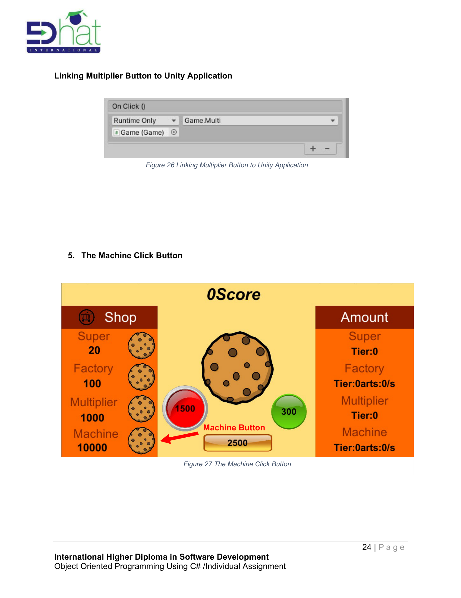
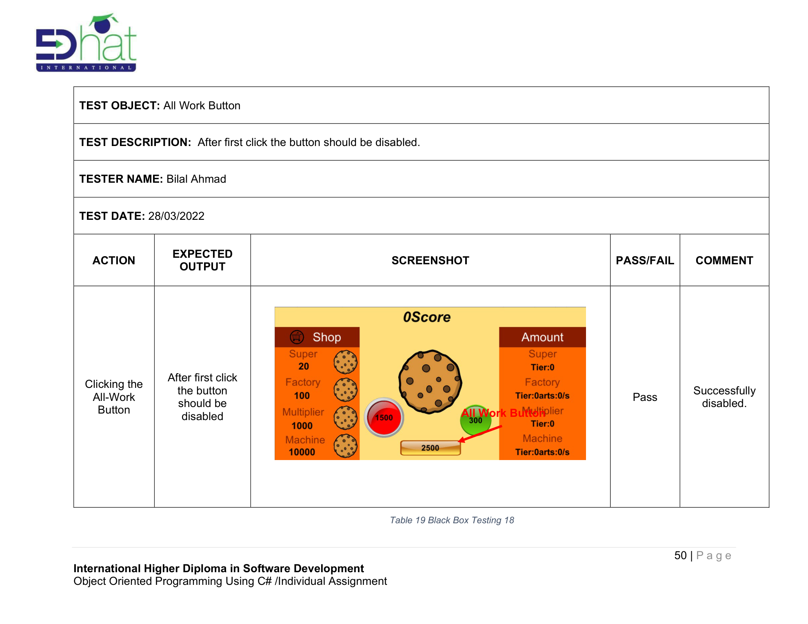
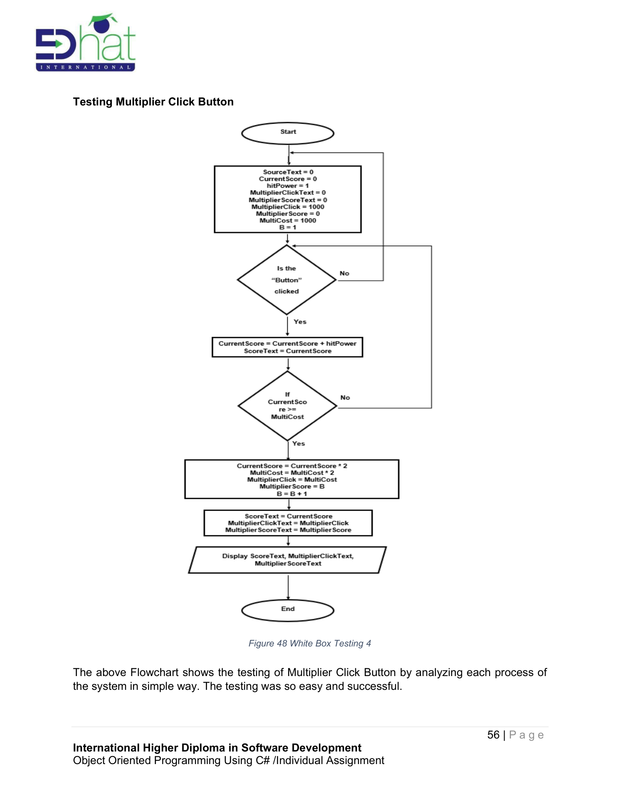

# Cookie Clicker — Unity C# Game 🎮

> Object-Oriented Programming using C# — **Clicker Game** built in **Unity**.  
> This README is adapted from the provided assignment PDF and includes high‑quality images of the UI, code, testing, UML, and the Gantt chart.

---

## 🚀 Overview
A simple yet extensible **Clicker/Idle** game implemented with **Unity** and **C#** demonstrating:
- Classes, objects, functions, loops, and selection
- Event‑driven UI (buttons) and scripted behaviour
- Incremental mechanics (upgrades, generators, multipliers)
- Black‑box & white‑box testing artifacts
- UML design and project planning (Gantt)

---

## 🧰 Tech & Tools
- **Engine:** Unity
- **Language:** C#
- **Paradigm:** Object-Oriented Programming
- **Testing:** Black-box & white-box
- **Design:** UML class diagram
- **Planning:** Gantt chart

---

## 🕹️ Game Features (Examples)
- **Main Click Button:** +1 score per click
- **Super Click:** +1 per click (stackable)
- **Factory:** +1 every 10s (passive income)
- **Multiplier:** doubles click gains
- **Machine:** +2 every 5s (passive income)
- **Boosters:** New Management (+10% all), Efficient (+1 factory output), All Work (+1 per owned factory to click value)
- **Costs:** Increase after purchase (e.g., ×1.2, ×1.5, ×2)

---

## 📸 Screenshots & Figures (High‑Quality)
Below are exported images (pages 12–66) that contain the game interface, Unity setup, scripts, button logic, testing artifacts, UML and Gantt.

- 
- 
- 
- 
- 
- 
- 
- 
- 
- 
- 
- 
- 
- 
- 
- 
- 
- 
- 
- 
- 
- 
- 
- 
- 
- 
- 
- 
- 
- 
- 
- 
- 
- 
- 
- 
- 
- 
- 
- 
- 
- 
- 
- 
- 
- 
- 
- 
- 

> Tip: Keep the `csharp_assets/` folder next to this `README.md` in your repo so these images render on GitHub.

---

## ✅ Testing
Includes **Black‑box** test tables (expected vs actual) and **White‑box** flowcharts for:
- Clicker, Super, Factory, Multiplier, Machine
- Boosters (New Management, Efficient, All Work)
- Button disabling after first use (where applicable)
- Cost increment logic on purchases

---

## 🧩 Design Artifact
- **UML Diagram:** Summarizes entities and relationships for the clicker mechanics.

---

## 🗓️ Project Plan
- **Gantt Chart:** Shows task sequencing and durations for the assignment timeline.

---

## 📚 References
- Cookie Clicker inspiration: orteil.dashnet.org/cookieclicker
- Unity & C# docs
- Additional sources listed in the original PDF

---

## 👤 Author
**Bilal Ahmad**  
International Higher Diploma in Software Development

---

> “Practice makes progress.” Keep iterating: add save/load, achievements, prestige loops, and nicer FX!
